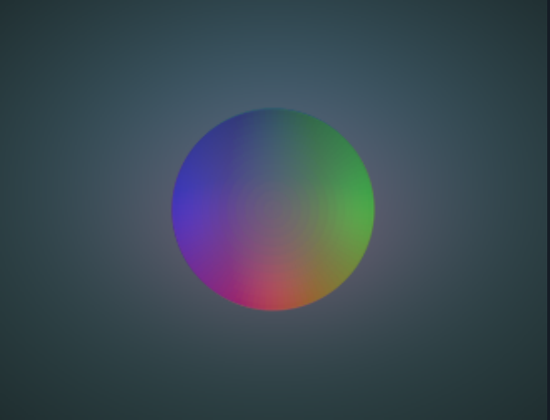

<div align="center">

# Mesh2Tact

### From 3D mesh geometry to synthetic tactile images and datasets

Mesh2Tact is a desktop application and Python package for generating GelSight-style tactile RGB images, geometric depth maps, and contact masks from 3D meshes.

**[Install](#install) · [Use the app](#use-the-app) · [Prepare and train](#prepare-and-train-classifiers) · [Outputs](#outputs) · [Python API](#python-api) · [Limitations](#limitations)**

</div>



*An example Mesh2Tact tactile RGB render. The appearance is configurable; it is a synthetic image, not a physical-sensor measurement.*

## What it does

Mesh2Tact projects a loaded mesh onto a virtual sensor plane, computes the visible contact depth, and renders a configurable tactile appearance. It is intended for repeatable dataset creation, renderer development, and reference-guided appearance fitting.

| Input | Mesh2Tact processing | Selected outputs |
| --- | --- | --- |
| STL, OBJ, or PLY mesh | Pose, scale, geometric projection, and contact-depth calculation | Tactile RGB and clean RGB PNGs |
| Sensor configuration | Background, lighting, colour response, and image effects | Depth PNG and depth arrays in metres |
| Optional reference photos | Fixed-pose, shared-appearance fitting | Contact mask, processed mesh, and settings JSON |

## Key capabilities

- **Interactive mesh setup** — load a mesh, set units and scale, and adjust position, rotation, and indentation using numeric controls or scene handles.
- **Multi-view inspection** — inspect the tactile image, geometric depth, raw depth, contact mask, and encoded surface normals.
- **Configurable tactile appearance** — tune sensor dimensions, pad/background colour, gradients, lighting, blur, vignette, texture, noise, contrast, gamma, and deterministic effect seeds.
- **Reference-guided calibration** — align and save several contact photographs, optionally reserve references for validation, and fit one shared appearance configuration.
- **Reproducible collection** — generate captures with seeded ranges for pose, indentation, in-plane position, and image-effect seeds.
- **Selective exports** — choose exactly which RGB, geometric, mesh, and per-sample metadata files to save.
- **Optional local prediction** — run compatible local torchvision checkpoints against the current tactile RGB image.

## Install

Mesh2Tact requires Python 3.10+ and a graphical desktop with OpenGL support for the Qt/VTK interface. The portable Conda file targets Python 3.11 and your `torch_gpu` environment.

```bash
git clone https://github.com/immanuelvalencia/Mesh2Tact.git
cd Mesh2Tact

conda env update -n torch_gpu -f environment.yml
conda activate torch_gpu
python -m pip install --no-deps -e .
```

If `torch_gpu` does not exist on the Linux machine, create it with `conda env create -f environment.yml` instead of the update command. The Conda file installs Qt, VTK, and the other native dependencies; the final pip command registers Mesh2Tact without replacing those Conda packages. Do not use `--prune` when updating an existing GPU environment.

PyTorch and torchvision are needed for classifier training and the **Predict** tab. They are deliberately absent from the app dependency files so you can keep the versions and CUDA build selected for `torch_gpu`. Check that both import in the Linux environment before training or using prediction.

For a pip-based installation in an already prepared environment, run `python -m pip install -r requirements.txt`. [pyproject.toml](pyproject.toml) is the source of package dependencies; `requirements.txt` is a portable editable-install shortcut, with no machine-specific paths or pinned Windows builds.

## Launch

```powershell
python main.py
```

Load an example directly:

```powershell
python main.py assets/shape/sphere.stl
```

The editable installation also provides:

```powershell
mesh2tact
mesh2tact --list-sensors
```

## Use the app

### 1. Load a mesh

In **General object**, select **Load STL…** and choose an STL, OBJ, or PLY mesh. Confirm the import units and scale: STL files default to millimetres. Position the object with the scene handles, rotation rings, or numeric controls.

The sensor plane is fixed at `Z = 0`. An object's Z value is its mesh-origin position, so the geometry and orientation determine first contact. **Maximum penetration** limits how far the lowest mesh point can extend below the plane.

### 2. Choose or tune a sensor

Load a saved configuration from [configs/sensors](configs/sensors), then use **Settings** to adjust the sensor geometry, background, lighting, and image effects. Capture resolution sets the saved image dimensions; preview scale affects only the interactive preview.

For a depth-based visual cue, **Tactile lighting → Depth shading** applies an empirical attenuation to the RGB appearance. **Directional shadows** is a separate experimental occlusion cue. Neither changes the exported depth, normal, or contact-mask arrays, and neither is a calibrated optical or deformation model.

### 3. Fit an appearance to reference images (optional)

Use the **Calibration** tab to upload a reference image, name and align its mesh contact, then save it into a collection. Repeat for each contact; use **No shape** for an empty-pad image. **Calibrate all saved references** estimates a shared appearance configuration, while entries marked **Validation only** are evaluated but excluded from fitting.

The default optimisation is bounded robust least squares. The local AI-assisted surrogate option is experimental and still concludes with robust least-squares refinement. Fitting estimates appearance parameters only: it does not establish force, elasticity, physical depth, or independent sensor validation. See the [calibration guide](docs/calibration.md) for the full workflow and saved artifacts.

### 4. Collect a dataset

Open **Data gathering**, select the payloads, sample count, parameter ranges, output layout, and seed, then begin collection. A run uses a snapshot of the object and settings at its start. Rotation components are sampled independently within their Euler-angle ranges, so they are not uniformly distributed over 3D orientation. Empty contacts are retained.

## Prepare and train classifiers

Run the dataset preparation interface from `torch_gpu`:

```bash
conda activate torch_gpu
python preprocess.py
```

Browse the parent folder containing `clean/`, `tactile/`, and `default/` (for example, `data/`). Click **Scan and compare branches** before export. The scan checks class names, sample IDs, image readability and size, unexpected files, and repeated RGB images. It matches `sample_000310_clean`, `sample_000310_tactile`, and `sample_000310_default` by the shared `sample_000310` capture index (older `*_tactile_clean` and `*_tactile_default` filenames are also accepted). Each triplet must have the same class and dimensions; its RGB pixels are expected to differ. The report shows issues and the number of complete triplets available per class.

Set the train, validation, and test percentages (totalling 100) and choose a new output folder. **Exclude missing, duplicate, or invalid captures from all three OUTPUT datasets** is enabled by default. It omits every problematic capture index from clean, tactile, and default together; no source photo is deleted or moved. The default grouping keeps each nested class subfolder (such as a trial or collection run) in one split; flat class folders use sample IDs. Turn off subfolder grouping only when the samples inside each folder are independent acquisitions. Captures with `contact_fraction: 0` in a matching settings JSON are excluded. Every class needs at least three groups for the three splits. Requested percentages are targets because groups can contain different numbers of images.

The scan report distinguishes missing filename pairs (`unmatched_files`) from duplicate or unreadable content (`excluded_samples` and `issues`). Both kinds are handled by the output exclusion option. `summary.json` records the excluded indices and the number omitted from each output branch.

Enable **Balance classes within train, validation, and test** to downsample each split to its smallest class. Selection is seeded and applied to complete clean/tactile/default triplets, so every branch keeps the same class counts, capture indices, and split assignments. This does not delete source photos. `summary.json` records the number of triplets omitted per class and split; balancing may shift the final train/validation/test percentages away from the requested targets.

The exported structure is standard torchvision `ImageFolder` input, with the same sample IDs and split assignment for all three image types:

```text
ml_dataset/
├── labels.txt
├── paired_manifest.csv
├── summary.json
├── clean/
│   ├── labels.txt
│   ├── manifest.csv
│   ├── train/<class>/image_000001.png
│   ├── val/<class>/image_000001.png
│   └── test/<class>/image_000001.png
├── tactile/    # Same labels and split/sample assignments
└── default/    # Same labels and split/sample assignments
```

The export renames each matched triplet to the same `image_######.png` name in all three branches. `paired_manifest.csv` maps that output name back to its original `sample_######` index and records its shared split and class. Inspect `summary.json` for issue counts and excluded indices. Training resizes RGB images to 224 × 224 and applies ImageNet channel normalization, matching the Predict tab.

Launch the training interface from `torch_gpu`:

```bash
python train.py
```

Browse the prepared `ml_dataset/` folder (or one image-type branch), choose whether to train all three branches separately, then click **Detect and confirm labels**. The interface shows all 43 supported architectures grouped by family. Select a family, individual models, or **Select all architectures**; the selected queue is displayed in the log and runs one model at a time. For each selected architecture and weight variant, the order is **tactile → default → clean**, then the next architecture begins. Set epochs, batch size, learning rate, patience, seed, workers, weight source, device, and the number of held-out test photos per label before starting. The interface streams the full terminal-style training log and shows current-model and overall-queue percentage bars. Its live readout includes model, epoch, train/validation/test phase, batch count, loss, and accuracy. Progress is reported at roughly 10% batch intervals per phase. **Stop training** requests a stop after the current batch and prevents later models from starting; if training does not respond within eight seconds, the UI force-stops the process. Completed model exports remain available, but an interrupted model's export may be incomplete.

The command-line workflow remains available. For example, train one architecture first:

```bash
python train.py --dataset-dir ml_dataset --image-type tactile --models resnet18 --epochs 20
```

Use `--image-type clean` or `--image-type default` for the other exports, or `--all-image-types` to train three independent models with the same selected architecture, seed, and hyperparameters on the aligned data. For example: `python train.py --dataset-dir ml_dataset --all-image-types --models resnet18 --epochs 20`. You can also point `--dataset-dir` directly at `ml_dataset/clean`, `ml_dataset/tactile`, or `ml_dataset/default` without an image-type flag. `train.py` uses the architecture families and validation approach from the supplied `train_suite.py`. Select models with `--models`, a family flag such as `--resnet` or `--swin`, or `--all` for all 43 supported architectures. `--weights default` downloads torchvision pretrained weights if they are not cached; use `--weights none` for training from scratch or `--weights all` for every available weight variant. Batch size, learning rate, patience, seed, worker count, device, and output folder are configurable with `--help`.

Every launch creates one timestamped session, and every image-type/architecture/weight combination gets its own self-contained run folder. For one ResNet-18 trained on all three image types, the layout is:

```text
train/session_YYYYMMDD_HHMMSS_id/
├── session_config.json
├── session_summary.json
├── runs.csv
├── comparison.csv
└── runs/
    ├── 001_tactile_resnet18_.../
    ├── 002_default_resnet18_.../
    └── 003_clean_resnet18_.../
        ├── best_resnet18_..._model.pth
        ├── last_resnet18_..._model.pth
        ├── labels.txt
        ├── run_config.json
        ├── run_status.json
        ├── training_log.txt
        ├── metrics.json
        ├── history.csv
        ├── training_history.png
        ├── classification_report.json
        ├── classification_report.txt
        ├── confusion_matrix.csv
        ├── confusion_matrix.png
        ├── test_predictions.csv
        ├── test_grid_predictions.csv
        └── sample_images/
            ├── test_grid.png
            ├── test_grid_manifest.csv
            └── images/*.png
```

The abbreviated files shown under `003_clean_...` are also saved in each tactile and default run folder. `runs.csv` lists the completed models; `comparison.csv` is written for three-branch training. Only held-out test photos enter `sample_images/`, never train or validation images. **Best** is selected by validation loss; **last** preserves the final completed epoch. Point Mesh2Tact's **Predict** tab at a run folder to load either checkpoint. Splitting renderings from the same class measures performance on new images of those classes; it does not establish recognition of unseen object instances or physical sensor images.

## Outputs

For date/time layout, outputs are organized by image type, mesh label, and run. Exact files depend on the selected save options.

```text
data/
├── tactile/<shape>/<date-time>/
│   ├── processed_mesh.ply
│   ├── sample_000001_tactile.png
│   ├── sample_000001_depth.png
│   ├── sample_000001_depth_m.npy
│   ├── sample_000001_raw_depth_m.npy
│   ├── sample_000001_contact.png
│   └── sample_000001_settings.json
├── clean/<shape>/<date-time>/
└── default/<shape>/<date-time>/
```

| Output | Description |
| --- | --- |
| Tactile RGB | Configured tactile render with selected image effects |
| Clean tactile RGB | Tactile render before image effects |
| Default tactile RGB | Render using the built-in Default sensor profile |
| Depth PNG | Visualized geometric depth |
| Depth arrays | Floating-point geometric depth in metres |
| Contact mask | Projected contact region |
| Processed mesh | Mesh in metres, before each sample pose transformation |
| Settings JSON | Sample pose, indentation, seed, and contact fraction |

The **Object label with index** layout writes numbered samples directly under each `<type>/<shape>/` folder and continues from existing tactile captures.

## Python API

Use the same renderer and collection code without opening the interface:

```python
from mesh2tact.geometric import GeometricSim
from mesh2tact.gather import GatherSettings, gather

sim = GeometricSim()
sim.load("assets/shape/sphere.stl", units="mm")
sim.cut_depth = 0.001  # 1 mm indentation after first contact

depth_m, tactile_rgb = sim.render()

settings = GatherSettings(count=10, seed=42)
result = gather(sim, "data", settings)
```

`GatherSettings` enables random rotation and indentation by default. Set `random_rotation=False` and `random_cut=False` to retain the configured pose and indentation. `gather()` updates the supplied simulator during collection; use a separate instance if its state must remain unchanged.

## Repository layout

```text
Mesh2Tact/
├── mesh2tact/       # Renderer, geometry, calibration, collection, GUI, and CLI
├── assets/          # Example meshes
├── configs/         # Sensor and geometric configurations
├── docs/            # User documentation and README figures
├── benchmarks/      # Benchmark scripts and records
├── tests/           # Automated tests
├── tools/           # Calibration utilities
├── publication/     # Manuscript source and figure-generation tools
├── preprocess.py     # Dataset preparation interface and split exporter
├── train.py          # Sequential classifier trainer and UI entry point
├── train_ui.py       # Training desktop interface
├── main.py          # Desktop entry point
└── pyproject.toml   # Package metadata and dependencies
```

## Development

Activate the environment used for installation and run:

```powershell
python -m pytest tests -q
```

Generated datasets, reference images, calibration archives, model weights, and rendered publication outputs are intentionally excluded from version control.

## Limitations

Mesh2Tact uses geometric projection plus image-based appearance rendering. It does not simulate contact forces, elastic gel deformation, shear, or physical light transport. Depth represents the surface visible from below the sensor plane and cannot capture hidden undercuts or gel wrapping.

Reference-image fitting estimates renderer appearance parameters. A lower image residual does not, by itself, demonstrate metric-depth accuracy, force calibration, generalization, or agreement with a physical sensor. Those require separate measurement and evaluation.
