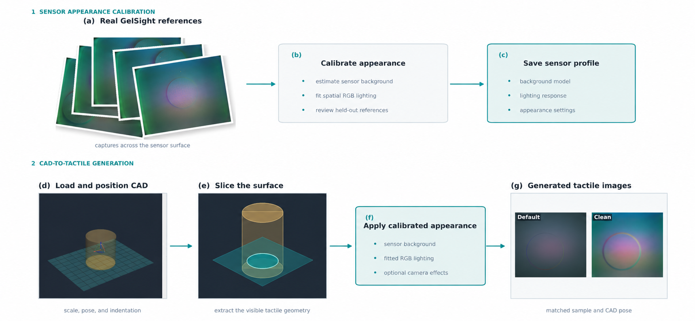
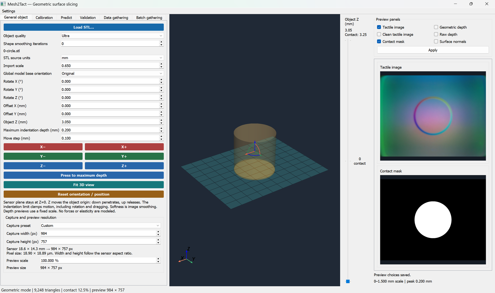
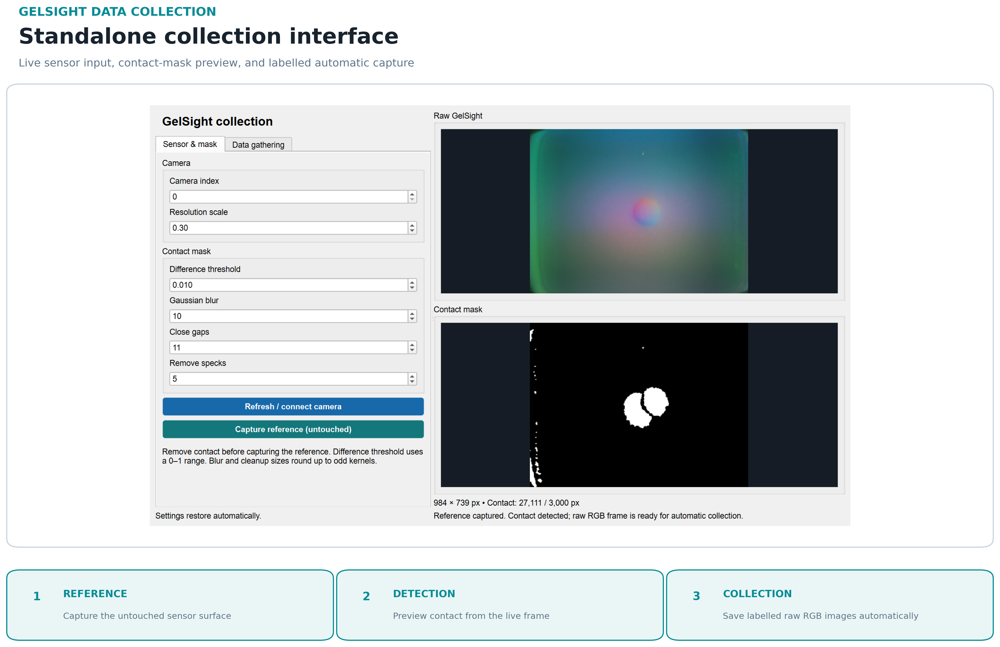
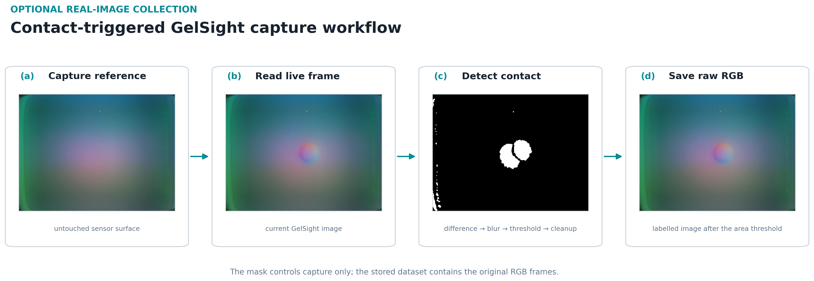
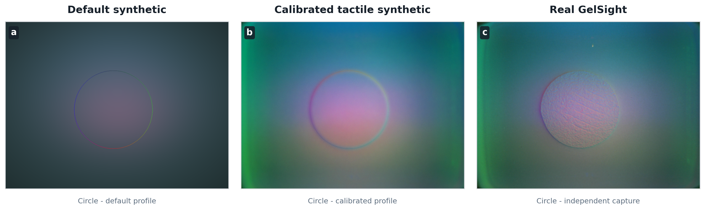
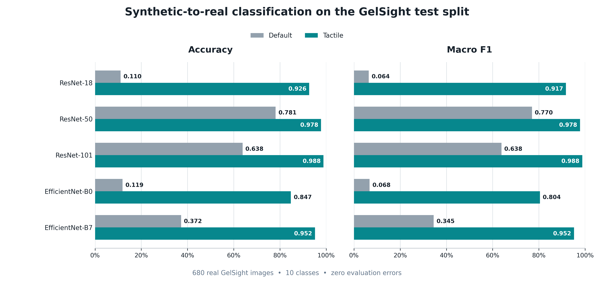

# Mesh2Tact

**Automated Visuotactile Image and Dataset Generation via CAD Mesh Slicing and Optical Rendering**

[](documentation/LICENSE)
[](https://github.com/immanuelvalencia/Mesh2Tact/releases/tag/v1.0.0)
[](environment.yml)
[](#requirements)
[](requirements.txt)

Mesh2Tact is a desktop application and research framework that converts 3D meshes into labelled synthetic visuotactile data. It combines contact geometry, configurable optical appearance, automated pose and scale sampling, aligned multi-branch export, dataset preparation, and GPU-enabled image-classification training in one workflow.

> **Publication:** the associated manuscript is currently under peer review. The publication link and DOI will be added when available.

---

## About Mesh2Tact

Mesh2Tact is intended for researchers building and evaluating visuotactile perception pipelines when collecting large labelled physical datasets is expensive or slow. It accepts STL, OBJ, and PLY geometry, projects the mesh against a configurable sensor plane, and renders selectable outputs suitable for inspection, training, and synthetic-to-real experiments.

### Calibration and generation workflow



Mesh2Tact separates sensor calibration from tactile-image generation. Real GelSight captures are first aligned with their reference geometry and used to fit the sensor background and spatial RGB lighting. The accepted settings are saved as a reusable sensor profile.

For dataset generation, the application loads and positions a CAD model, slices its visible tactile geometry, and applies the saved profile. The example shows matched **Default** and **Clean** outputs for the same CAD pose. Default is the geometric baseline; Clean contains the calibrated optical appearance before optional camera noise and texture.

Calibration adjusts image appearance for the configured sensor. It does not model force, elasticity, shear, friction, or full gel mechanics.

### Desktop interface



The interface brings mesh placement, sensor configuration, calibration, prediction, validation, and dataset gathering into one application. The central viewport shows the CAD model relative to the sensor plane, while the preview area displays the selected image and geometry outputs.

### Key capabilities

- interactive mesh loading, pose control, scaling, and sensor configuration;
- contact, depth, clean RGB, default RGB, and calibrated tactile RGB outputs;
- configurable lighting, gel appearance, texture, blur, and image effects;
- reproducible or randomized batch generation with contact checks;
- aligned sample identities across output branches;
- dedicated real GelSight image collection;
- leakage-aware train, validation, and test preparation; and
- GPU training for torchvision classification architectures.

---

## Requirements

- Windows 10/11 or a modern 64-bit Linux distribution
- Python 3.11
- Conda or Miniconda
- An NVIDIA GPU with a driver compatible with CUDA 12.8 for GPU training and inference
- A desktop display environment with OpenGL support for the Qt/VTK interface

The pinned environment includes PyTorch, torchvision, NumPy, SciPy, trimesh, OpenCV, Pillow, Matplotlib, PyQt5, QtPy, VTK, PyVista, PyVistaQt, PyYAML, and scikit-learn. The PyTorch wheels provide the CUDA runtime; a separate CUDA Toolkit installation is not normally required, but a compatible NVIDIA driver is.

---

## Installation

Clone the repository and create the project-specific environment:

```bash
git clone https://github.com/immanuelvalencia/Mesh2Tact.git
cd Mesh2Tact
conda env create -f environment.yml
conda activate mesh2tact
```

Verify that PyTorch can access the GPU:

```bash
python -c "import torch; print(torch.__version__); print(torch.cuda.is_available()); print(torch.cuda.get_device_name(0) if torch.cuda.is_available() else 'CPU')"
```

---

## Quick start

Launch the desktop application:

```bash
python main.py
```

Open a mesh at launch:

```bash
python main.py assets/shapes/3-triangle.stl
```

In the application:

1. Load or select a mesh.
2. Choose a sensor configuration and adjust the pose, scale, gel, lighting, and image effects.
3. Inspect the preview and contact response.
4. Open the gathering panel, choose the output branches and sampling ranges, and select an output directory.
5. Generate the dataset. Keep the same object label and sample identity across branches when preparing comparative training data.

---

## Optional: GelSight collection and Sim2Real validation

The Mesh2Tact simulator does not require a physical GelSight sensor. A standalone utility is provided to generate a labelled GelSight image dataset from a connected sensor. This workflow was used only to collect and prepare the real images for the Sim2Real image-classification evaluation.

### Collect real GelSight images

Launch the standalone collector:

```bash
python annotate.py
```

The collector displays the live RGB frame and its detected contact region. Set the class label, capture an untouched sensor reference, and enable automatic collection. A frame is accepted when the detected contact area reaches the selected minimum.



Raw RGB images are saved under:

```text
data/gelsight/<class>/*_raw.png
```

The saved files remain unmodified camera images. The binary contact mask is used only as the capture trigger and preview; it is not stored with the dataset.

### Collection workflow

The collector first records an untouched sensor image as its reference. Each incoming frame is converted to grayscale and compared with that reference using an absolute difference. A Gaussian blur reduces pixel noise, a binary threshold isolates changed regions, and elliptical morphological closing and opening fill small gaps and remove isolated specks. The number of nonzero mask pixels is then compared with the capture threshold.



The threshold, blur, cleanup kernels, and minimum contact area can be adjusted in the collector launched by `annotate.py` to match the camera and sensor surface.

### Prepare the validation dataset

Launch the preprocessing interface:

```bash
python preprocess.py
```

For synthetic data, select the aligned source branches and export them together so each sample keeps the same label and split assignment across `default`, `tactile`, `clean`, and `mask`. For the real GelSight images, select the flat class-folder source and export a separate `train/val/test` dataset.

The GelSight preprocessing path is also available from the command line:

```bash
python preprocess.py --gelsight --source data/gelsight --output data/gelsight_processed --seed 42
```

### Train the comparison classifiers

Train one or more torchvision models on a prepared branch:

```bash
python train.py --dataset-dir ml_dataset --image-type tactile --models resnet50 --device cuda
```

Useful alternatives include `--image-type default`, `--image-type clean`, `--image-type mask`, `--all-image-types`, model-family flags, or `--all`. Run `python train.py --help` for the complete command-line interface. Training outputs are written to `train/` by default and include checkpoints, metrics, a confusion matrix, training history, predictions, and a reusable test-image grid. These training tools are optional and were used for the Sim2Real comparison reported below.

---

## Output structure

A labelled synthetic collection can contain aligned branches such as:

```text
data/
├── default/<class>/sample_000001_tactile_default.png
├── tactile/<class>/sample_000001_tactile.png
├── clean/<class>/sample_000001_tactile_clean.png
└── mask/<class>/sample_000001_contact.png
```

Additional outputs can include depth images, metric depth arrays, raw depth arrays, per-sample settings, and processed meshes. Generated datasets, checkpoints, validation runs, and local preferences are intentionally excluded from Git by `.gitignore`.

---

## Sim2Real results and discussion

### Image domains



The figure identifies the three image domains used in the study. **Default** is the uncalibrated synthetic baseline, **Tactile** is the calibrated synthetic rendering, and **GelSight** is a real sensor image. The two synthetic images share the same circle geometry and pose; the GelSight photograph is an independent example from the same class and is not pixel-registered to them.

### Classification results

Classifiers trained on each synthetic domain were evaluated on the same real GelSight test split: 680 images across 10 classes. All listed models completed evaluation without loading or inference errors. Inputs were converted to RGB, resized to 224 × 224, and normalized with ImageNet statistics without test-time augmentation.



| Model | Default accuracy | Tactile accuracy | Default Macro F1 | Tactile Macro F1 |
|---|---:|---:|---:|---:|
| ResNet-18 | 0.1103 | 0.9265 | 0.0642 | 0.9174 |
| ResNet-50 | 0.7809 | 0.9779 | 0.7701 | 0.9781 |
| ResNet-101 | 0.6382 | 0.9882 | 0.6381 | 0.9877 |
| EfficientNet-B0 | 0.1191 | 0.8471 | 0.0677 | 0.8045 |
| EfficientNet-B7 | 0.3721 | 0.9515 | 0.3452 | 0.9521 |

Every model performed better when trained on calibrated Tactile images than on the Default baseline. ResNet-101 was strongest in this comparison, reaching 0.9882 accuracy and 0.9877 Macro F1. The pattern suggests that matching the GelSight background and lighting helps transfer from synthetic training images to real captures. These results come from one configured split; repeated trials and cross-sensor evaluation are still needed.

---

## Repository layout

```text
main.py          Launch the Mesh2Tact desktop application
annotate.py      Collect flat, class-labelled real GelSight images
preprocess.py    Inspect and prepare train/validation/test datasets
train.py         Train and report torchvision classifiers
mesh2tact/       Core geometry, rendering, calibration, GUI, and ML modules
configs/         Sensor and application configurations
assets/          Example meshes
```

---

## Citation

If Mesh2Tact contributes to your research, please cite the software and the associated paper once it is published. Citation metadata is provided in [`CITATION.cff`](documentation/CITATION.cff).

The associated manuscript, **“Mesh2Tact: Automated Visuotactile Image and Dataset Generation via CAD Mesh Slicing and Optical Rendering,”** is currently under peer review. Its publication link and DOI will be added when available.

This work brings together researchers from the following participating laboratories and institutions:

- **Department of Biomedical, Manufacturing, and Robotics Engineering**, Gokongwei College of Engineering, De La Salle University, Philippines
- **Intelligent Systems Laboratory**, Center for Engineering and Sustainable Development Research, De La Salle University, Philippines
- **Tactile Optimization and User-Centric Haptics (TOUCH) Lab**, National Chin-Yi University of Technology, Taiwan

Until the paper is published, cite the repository as:

```bibtex
@software{valencia2026mesh2tact,
  author = {Valencia, Immanuel Jose and Vicerra, Ryan Rhay and See, Aaron Raymond and Baldovino, Renann and Billones, Robert Kerwin and Dadios, Elmer and Bandala, Argel and Naguib, Raouf},
  title = {Mesh2Tact: Automated Visuotactile Image and Dataset Generation via CAD Mesh Slicing and Optical Rendering},
  year = {2026},
  url = {https://github.com/immanuelvalencia/Mesh2Tact}
}
```

---

## Contributing and support

Bug reports, reproducible feature proposals, documentation corrections, and focused pull requests are welcome. Read [`CONTRIBUTING.md`](documentation/CONTRIBUTING.md) before opening a pull request. Use GitHub Issues for public support and follow [`SECURITY.md`](documentation/SECURITY.md) for private vulnerability reports.

---

## License

Mesh2Tact source code and documentation are released under the [MIT License](documentation/LICENSE).
